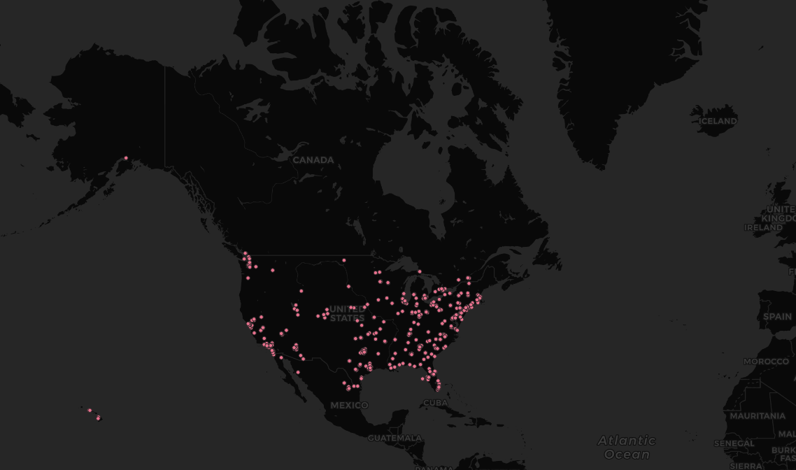

# Lab 2

In this lab assignment, I crawled Twitter for the latest tweets from the contiguous United States, Alaska, and Hawaii areas to export the data along with the users' latitude and longitude at the time of tweeting into a CSV file.

Then, I imported the data into QGIS as a layer to display it onto a `Dark Matter (retina)` base map.

From the map, we can see that most users are concentrated along the coasts (East coast and West coast). Especially in the west coast, it is a lot denser in western Washington state (Greater Seattle area) and Southern California. Based on this, we can start to speculate that Twitter is more popular among urban residents than rural area residents.